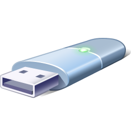

<h1> USBTool
   Программа для записи образов на вашу флешку 
</h1>

<h1 align="left">Преимущества</h1>

 • Поддержка записи macOS 
 • Поддержка Windows 7 SP2 и новее 
 • Запись ISO, IMG, CDR и других образов... 
 • Встроенный загрузчик образов 

<h1 align="left">Что нужно для запуска?</h1>

 • Windows 7 SP2 x64 и новее 
 • Microsoft Visual C++ 2015-2022 

<h1 align="left">Есть вопросы?</h1>

 Telegram: @zeroxxDEV 
 Discord: zeroxdev_39420 

